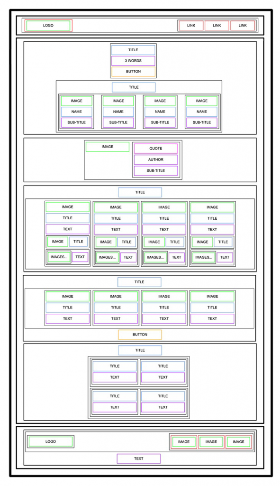

# alu-web-development - CSS Advanced



This project is the second step of a series in which we implement a complete
webpage, from scratch, starting from a **designer file** provided on Figma.

The **HTML, advanced** project has already been completed: the full semantic
HTML structure of the page lives in `index.html`. This project focuses on the
**CSS and the style** of the page, following the same Figma design.

## Objectives

- Build on the clean, semantic HTML produced in the **HTML, advanced** project.
- Style the page with pure, hand-written **CSS** to match the Figma design.
- Practice layout techniques (flexbox, positioning, spacing) to reproduce the
  designer's mockup.
- Round floating values from the design where needed.
- No frameworks, no libraries — just HTML and CSS.

## Getting started

The design file is available on Figma. Create an account, then:

1. Open the **Page in Figma**.
2. Click on **"Duplicate to your Drafts"** to get access to all design details.
3. Download the missing fonts if your computer does not have them:
   - [Source Sans Pro](https://fonts.google.com/specimen/Source+Sans+Pro)
   - [Spin Cycle OT](https://www.fontsgeek.com/)
4. Some values in the design are floats — feel free to round them.

## Requirements

- `index.html` copied from the `html_advanced` project — it contains the entire
  HTML structure of the page and must remain untouched.
- Pure CSS only — no CSS frameworks, no preprocessors, no inline styles.
- The styled page must reflect the design shown in the Figma mockup.

## Repository structure

```
alu-web-development/
└── css_advanced/
    ├── README.md              (this file)
    ├── index.html             (HTML, advanced — page structure)
    ├── images/                (page assets: avatars, videos, social icons...)
    └── smileschool_mockup.png (design preview)
```

## Author

[ALU](https://www.alueducation.com/) student — project from the
**alu-web-development** repository.